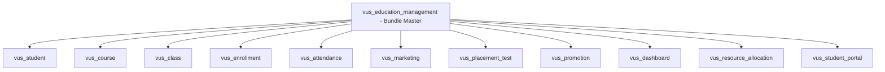
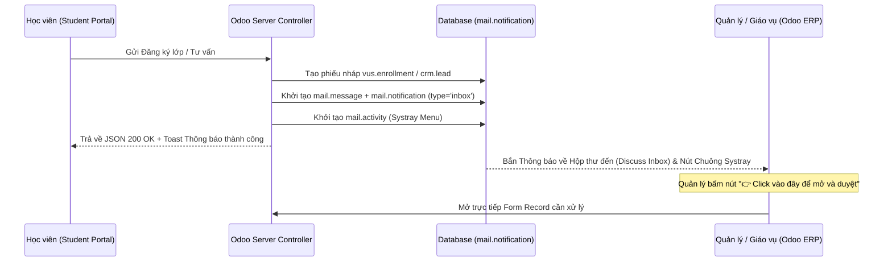
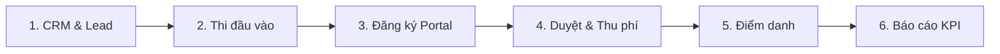

# BÁO CÁO NGHIỆP VỤ & HƯỚNG DẪN CÀI ĐẶT HỆ THỐNG VUS ERP & STUDENT PORTAL

---

## 📋 1. BÁO CÁO TỔNG QUAN DỰ ÁN

Bộ giải pháp mở rộng (Custom Addons) được thiết kế và phát triển trên nền tảng **Odoo 17.0 ERP** nhằm mục đích số hóa toàn diện quy trình vận hành đào tạo, quản lý tuyển sinh, tiếp thị marketing, kế toán học phí và cổng thông tin học viên tự phục vụ cho **Hệ thống Anh Văn Hội Việt Mỹ (VUS)**.

### Mục tiêu trọng tâm:
1. **Số hóa quy trình tuyển sinh & tiếp thị**: Tự động hóa từ khâu thu thập Lead từ chiến dịch Marketing, quản lý lịch thi xếp lớp đầu vào (Placement Test) đến phân bổ phiếu ghi danh.
2. **Quản lý đào tạo & phân bổ tài nguyên**: Quản lý khóa học, lớp học, phòng học, xếp ca rảnh giảng viên, tự động điểm danh hàng loạt, xử lý báo vắng, dạy thay và dạy bù.
3. **Kế toán học phí & Tự động hóa hóa đơn**: Áp dụng ưu đãi/học bổng tự động, kết nối trực tiếp với phân hệ Kế toán Odoo (`account.move`), tự động sinh hóa đơn bán hàng (`out_invoice`), hỗ trợ thanh toán VietQR & VNPay.
4. **Cổng thông tin Học viên Trực tuyến (VUS Student Portal)**: Xây dựng trải nghiệm ứng dụng đơn trang (Single Page Application - SPA) hiện đại, bảo mật, giúp học viên đăng ký lớp online, tra cứu lịch học tương tác, theo dõi độ chuyên cần và thanh toán trực tuyến.
5. **Hệ thống thông báo thời gian thực & Điều hướng 1-Click**: Tích hợp thông báo hai chiều vào **Hộp thư đến (Discuss Inbox)** và **Thanh tác vụ (Systray)** kèm nút bấm chuyển trang trực tiếp mở Form dữ liệu chỉ với 1 cú nhấp chuột.

---

## 🏛️ 2. KIẾN TRÚC MÔ-ĐÙN VÀ CÁC PHÂN HỆ NÒNG CỐT

Hệ thống được thiết kế theo kiến trúc Module hóa (Modular Architecture), bao gồm **11 mô-đun tùy chỉnh** liên kết chặt chẽ:



### Chi tiết chức năng từng mô-đun:

#### 1. `vus_student` - Quản lý Học viên & Giảng viên
- Kế thừa danh mục đối tác chuẩn `res.partner` của Odoo.
- Theo dõi chi tiết vòng đời học viên: `Potential` (Tiềm năng), `Waiting` (Chờ xếp lớp), `Studying` (Đang học), `Reserved` (Bảo lưu), `Completed` (Hoàn thành).
- Phân định rõ vai trò Học viên (`is_student`) và Giảng viên (`is_teacher`).
- Cấu hình giới hạn **Số lớp dạy tối đa trong kỳ** (`max_classes`) cho từng giảng viên.

#### 2. `vus_course` - Quản lý Chương trình & Khóa học (`vus.course`)
- Quản lý các chương trình học (SuperKids, Young Leaders, IELTS Foundation, English Hub...).
- Lưu trữ thông tin học phí chuẩn, cấp độ, tổng số buổi học, thời lượng.
- Tích hợp Smart Button xem nhanh số lớp học đang tuyển sinh.
- Cấu hình chỉ tiêu **Số lớp tối đa trong kỳ** (`max_classes`).

#### 3. `vus_class` - Quản lý Lớp học (`vus.class`)
- Ghi nhận lịch học, ca học (`time_slot_id`), phòng học (`classroom`), giảng viên phụ trách, sĩ số tối đa.
- Quản lý trạng thái tuyển sinh: `draft` (Nháp), `opened` (Đang mở đăng ký), `in_progress` (Đang học), `completed` (Đã kết thúc), `cancelled` (Đã hủy).
- Tích hợp Smart Button thống kê học viên thực tế và danh sách đăng ký mới.

#### 4. `vus_enrollment` - Phiếu ghi danh & Tự động hóa Kế toán (`vus.enrollment`)
- Khởi tạo phiếu ghi danh cho học viên khi đăng ký lớp.
- **Tự động hóa Kế toán**: Khi duyệt phiếu ghi danh, hệ thống tự động sinh Hóa đơn khách hàng (`out_invoice`), hạch toán học phí và tự động điều hướng sang giao diện Form hóa đơn.
- Tự động chuyển trạng thái phiếu sang `paid` (Đã thanh toán) khi hóa đơn được thanh toán đầy đủ.
- Kế thừa `mail.thread` và `mail.activity.mixin` cho phép trao đổi qua Chatter.

#### 5. `vus_attendance` - Điểm danh Chuyên cần Hàng loạt (`vus.attendance`)
- Quản lý bảng điểm danh theo buổi (`vus.attendance.sheet`).
- Hỗ trợ nút **Tải danh sách học viên** nạp nhanh toàn bộ học viên của lớp và điểm danh 1-Click (Có mặt / Đi trễ / Vắng mặt).
- Lưu vết lịch sử chuyên cần trực tiếp lên từng phiếu ghi danh của học viên.

#### 6. `vus_marketing` - Chiến dịch Marketing & CRM Leads (`vus.marketing.campaign`)
- Quản lý ngân sách chiến dịch tiếp thị, chi phí thực tế và nguồn thu hút học viên (Facebook, Google, Website, Event).
- Liên kết trực tiếp với `crm.lead` để theo dõi tỷ lệ chuyển đổi Lead thành Học viên chính thức.
- Tự động tính toán chỉ số hiệu quả đầu tư **ROI (%)** và doanh thu thực thu.

#### 7. `vus_placement_test` - Thi Đầu vào & Đánh giá Trình độ (`vus.placement.test`)
- Quản lý lịch kiểm tra đầu vào và hội đồng chấm thi.
- Chấm điểm 4 kỹ năng (Nghe, Nói, Đọc, Viết), tự động cộng tổng điểm và đề xuất khóa học tương ứng.
- Tích hợp nút **Ghi danh nhanh (Quick Enroll)** tự động sinh phiếu ghi danh từ kết quả thi.

#### 8. `vus_promotion` - Học bổng & Ưu đãi Học phí (`vus.promotion`)
- Quản lý mã giảm giá, học bổng (Giảm theo % hoặc Giảm số tiền cố định VND).
- Kiểm tra điều kiện thời hạn sử dụng và số lượt dùng tối đa, tự động trừ tiền trên phiếu ghi danh.

#### 9. `vus_dashboard` - Báo cáo Phân tích Tuyển sinh (`vus.recruitment.report`)
- Xây dựng mô hình SQL View tổng hợp dữ liệu CRM Lead, Thi đầu vào, Phiếu ghi danh và Hóa đơn.
- Cung cấp giao diện báo cáo Pivot và biểu đồ trực quan phục vụ ban quản lý.

#### 10. `vus_resource_allocation` - Phân bổ Tài nguyên & Phân công Giảng dạy
- Quản lý phiếu đăng ký ca rảnh của giảng viên theo kỳ học (`vus.academic.term`).
- Tự động gợi ý danh sách giảng viên khả dụng không bị trùng lịch dạy.
- Quản lý lịch học chi tiết từng buổi (`vus.class.session`), quản lý yêu cầu báo vắng và phân công giảng viên dạy thay/dạy bù.
- Tích hợp tiến trình Cron tự động gửi thông báo lịch dạy hàng ngày cho giảng viên.

#### 11. `vus_student_portal` - Cổng thông tin Học viên Trực tuyến (Student Portal)
- Xây dựng cổng thông tin tự phục vụ dành cho học viên trên giao diện Single Page Application (SPA).
- Đăng nhập bảo mật bằng **Mã học viên + Ngày sinh**.
- Đăng ký lớp học trực tuyến, tự động kiểm tra trùng lịch học.
- Quản lý phiếu ghi danh, hủy phiếu nháp, xem mã chuyển khoản VietQR và thanh toán VNPay.
- Xem lịch học tương tác dạng ô Lịch tháng (Calendar Grid 7x5) kèm màu sắc thể hiện trạng thái chuyên cần.
- Đăng ký nhận tư vấn khóa học mới.

---

## ⚡ 3. CƠ CHẾ THÔNG BÁO THỜI GIAN THỰC & ĐIỀU HƯỚNG TRỰC TIẾP

Dự án đã triển khai cơ chế thông báo toàn diện kết hợp giữa **Odoo Backend** và **Student Portal**:



### 1. Luồng bắn thông báo Hộp thư đến (Discuss Inbox) & Systray:
- Mỗi khi có sự kiện quan trọng (Đăng ký lớp mới, Đăng ký tư vấn, Cảnh báo hạn đóng học phí, Lịch dạy trong ngày, Đôn đốc đăng ký ca rảnh), hệ thống tự động:
  1. Khởi tạo `mail.activity` nhắc việc trên thanh Menu đồng hồ Systray.
  2. Khởi tạo `mail.message` đính kèm bản ghi dữ liệu.
  3. Khởi tạo `mail.notification` với `notification_type = 'inbox'` đẩy thẳng tin nhắn vào **Hộp thư đến (Discuss Inbox)** của Quản lý / Giảng viên với biểu tượng chấm đỏ chưa đọc.

### 2. Nút bấm điều hướng 1-Click (Direct Link Button):
- Mọi nội dung thông báo đều chứa một nút bấm điều hướng được thiết kế nổi bật với tông màu VUS (`#0C2B5C`):  
  `👉 Click vào đây để mở và duyệt Phiếu VUS/ENR/2026/...`
- Đường dẫn có định dạng chuẩn: `http://localhost:8069/web#id={res_id}&model={res_model}&view_type=form`.
- Khi người dùng nhấp vào thông báo trong Hộp thư đến, hệ thống sẽ mở trực tiếp màn hình Form xử lý dữ liệu mà không cần phải truy cập danh sách tìm kiếm thủ công.

### 3. Hệ thống Thẻ Alert & Hộp thoại Modal Box giao diện mới:
- **Thẻ Alert `.vus-alert-box`**: Thay thế các thẻ alert mặc định bằng bộ CSS Design System hiện đại với dải viền màu chủ đạo, hiệu ứng mờ nhạt pastel, bo góc `12px` và icon đại diện riêng cho từng trạng thái (`info`, `success`, `warning`, `danger`).
- **Hộp thoại Modal Box `showConfirmModal()`**: Thay thế toàn bộ các popup `alert()` và `confirm()` thô sơ của trình duyệt bằng Hộp thoại Modal Box VUS làm mờ phông nền (`backdrop-filter: blur(6px)`), nút bấm xác nhận thiết kế chuẩn UI/UX.

---

## 🧮 4. THUẬT TOÁN KIỂM TRA TRÙNG LỊCH HỌC (`check_classes_overlap`)

Để ngăn chặn học viên đăng ký hai lớp học trùng thời gian, hệ thống sử dụng thuật toán kiểm tra trùng lịch đa tầng `check_classes_overlap(cls1, cls2)`:

```python
def check_classes_overlap(cls1, cls2):
    # Bước 1: Kiểm tra giao thoa khoảng ngày khai giảng/kết thúc
    start1 = cls1.start_date or fields.Date.today()
    end1 = cls1.end_date or (start1 + timedelta(days=90))
    start2 = cls2.start_date or fields.Date.today()
    end2 = cls2.end_date or (start2 + timedelta(days=90))

    if max(start1, start2) > min(end1, end2):
        return False, ''  # Không trùng ngày

    # Bước 2: Phân tách và trích xuất nhóm các thứ trong tuần (DOW: 0=T2, ..., 6=CN)
    days1 = parse_schedule_days(cls1.schedule or (cls1.time_slot_id.name if cls1.time_slot_id else ''))
    days2 = parse_schedule_days(cls2.schedule or (cls2.time_slot_id.name if cls2.time_slot_id else ''))

    if not days1 or not days2 or not (days1 & days2):
        return False, ''  # Không trùng thứ trong tuần

    # Bước 3: Phân tách và kiểm tra giao thoa khoảng giờ học (Giờ bắt đầu & Giờ kết thúc)
    range1 = parse_schedule_time_range(cls1.schedule or (cls1.time_slot_id.name if cls1.time_slot_id else ''))
    range2 = parse_schedule_time_range(cls2.schedule or (cls2.time_slot_id.name if cls2.time_slot_id else ''))

    if range1 and range2:
        t1_start, t1_end = range1
        t2_start, t2_end = range2
        if max(t1_start, t2_start) >= min(t1_end, t2_end):
            return False, ''  # Không trùng khoảng giờ (Ví dụ: Ca sáng vs Ca tối cùng ngày)

    return True, f"Bị trùng lịch học với lớp '{cls2.class_name}'"
```

### Ưu điểm vượt trội:
- **Tự động làm sạch dữ liệu**: Sử dụng Regex loại bỏ các định dạng giờ (như `18:00`, `19.30`) và chữ ca (như `Ca 1`, `Ca 2`) trước khi phân tích thứ trong tuần, tránh việc con số `8` trong `18:00` bị nhận diện nhầm thành Chủ nhật.
- **Tránh báo động giả**: Nếu hai lớp học trùng ngày (ví dụ cùng học Thứ 7 - Chủ Nhật) nhưng học ở hai ca giờ khác nhau (Ca 1: 17:30 - 19:00 vs Ca 2: 19:15 - 20:45), thuật toán vẫn xác nhận **KHÔNG TRÙNG** và cho phép học viên đăng ký bình thường.

---

## 🛠️ 5. YÊU CẦU HỆ THỐNG VÀ HƯỚNG DẪN CÀI ĐẶT

### 1. Yêu cầu môi trường:
* **Hệ điều hành**: Windows 10/11, Linux (Ubuntu/Debian) hoặc Docker.
* **Odoo**: Phiên bản **Odoo 17.0** (Community hoặc Enterprise).
* **Python**: Phiên bản **3.10** trở lên.
* **Database**: **PostgreSQL** 12 trở lên.
* **Các phụ thuộc tiêu chuẩn**: `contacts`, `crm`, `account`, `mail`.

---

### 2. Các bước cài đặt chi tiết:

#### Bước 1: Khai báo `addons_path`
Mở file cấu hình `odoo.conf` của bạn và thêm đường dẫn đến thư mục `custom_addons`:

```ini
# Ví dụ trên Windows:
addons_path = C:\Program Files\Odoo 17.0.20260615\server\odoo\addons,C:\du-an-cua-ban\custom_addons

# Ví dụ trên Linux / Docker:
addons_path = /usr/lib/python3/dist-packages/odoo/addons,/mnt/extra-addons/custom_addons
```

#### Bước 2: Khởi động lại Dịch vụ Odoo
- **Windows (PowerShell Admin)**:
  ```powershell
  Restart-Service -Name "odoo-server-17.0"
  ```
- **Linux**:
  ```bash
  sudo systemctl restart odoo
  ```

#### Bước 3: Cài đặt Mô-đun lên Odoo Database
1. Đăng nhập giao diện Odoo với tài khoản **Administrator**.
2. Bật **Chế độ nhà phát triển (Developer Mode)** tại *Cài đặt (Settings)*.
3. Truy cập menu **Ứng dụng (Apps)** -> Nhấn **Cập nhật danh sách ứng dụng (Update Apps List)**.
4. Tìm kiếm từ khóa `vus_education_management` và nhấn **Kích hoạt (Activate)**.  
   *(Hệ thống sẽ tự động kích hoạt đồng bộ 11 mô-đun con thuộc hệ sinh thái VUS)*.

---

## 🔄 6. HƯỚNG DẪN VẬN HÀNH KIỂM THỬ ĐẦU-CUỐI (END-TO-END WORKFLOW)

Hãy thực hiện kiểm thử hệ thống theo đúng quy trình vận hành thực tế:



### Trình tự kiểm thử:

1. **Tiếp nhận Yêu cầu Tư vấn (CRM & Marketing)**:
   - Truy cập Cổng học viên: `http://localhost:8069/student/portal`.
   - Vào tab **Đăng ký Tư vấn** -> Nhập thông tin học viên mới và chọn Chiến dịch Marketing quan tâm -> Bấm Gửi yêu cầu.
   - Kiểm tra Backend Odoo: Một Lead mới được tạo trong CRM kèm thông báo nổ ngay trong **Hộp thư đến (Discuss Inbox)** của Quản lý.

2. **Thi Đầu vào & Đề xuất Khóa học (Placement Test)**:
   - Vào menu **Tuyển sinh & Đăng ký** -> **Kiểm tra đầu vào** -> Chọn bài thi đầu vào.
   - Nhập điểm 4 kỹ năng -> Bấm **Xác nhận điểm** -> Bấm nút **Ghi danh nhanh** để tạo Phiếu ghi danh.

3. **Học viên Đăng ký Lớp trên Portal**:
   - Đăng nhập Cổng học viên bằng Mã học viên (ví dụ: `VUS-0008`) và Ngày sinh.
   - Vào tab **Lớp học & Đăng ký** -> Chọn lớp học mở -> Bấm **Đăng ký học**.
   - Nếu bị trùng lịch với lớp đang học, hệ thống sẽ hiện Thẻ Alert màu vàng cảnh báo chi tiết lý do trùng lịch.

4. **Quản lý Duyệt phiếu & Hạch toán Kế toán**:
   - Quản lý mở **Hộp thư đến (Discuss Inbox)** trong Odoo -> Nhấp vào nút `👉 Click vào đây để mở và duyệt Phiếu...`.
   - Màn hình chuyển ngay sang Form phiếu ghi danh nháp -> Bấm **Xác nhận & Tạo hóa đơn**.
   - Màn hình tự động điều hướng sang Form Hóa đơn bán hàng -> Bấm **Ghi nhận thanh toán**.

5. **Điểm danh & Theo dõi Chuyên cần**:
   - Giảng viên/Giáo vụ vào menu **Điểm danh** -> **Điểm danh theo buổi** -> Nhấn **Tải danh sách học viên** -> Tiến hành điểm danh 1-Click.
   - Học viên mở tab **Tổng quan** trên Portal -> Khung Lịch học tương tác dạng ô Lịch tháng tự động hiển thị các buổi học kèm màu chuyên cần (Có mặt: Xanh, Đi trễ: Vàng, Vắng: Đỏ).

6. **Phân tích Doanh thu & Báo cáo KPI**:
   - Mở menu **Báo cáo KPI** -> Xem biểu đồ Pivot phân tích doanh thu học phí, số lượng lead chuyển đổi và tỷ suất **ROI (%)** của từng chiến dịch Marketing.

---

## 🛡️ 7. PHÂN QUYỀN VÀ BẢO MẬT (SECURITY & RBAC)

Hệ thống được cấu hình phân quyền 3 cấp độ:
- **Quản lý (Manager)**: Full quyền CRUD trên toàn bộ phân hệ, xem báo cáo doanh thu & KPI.
- **Nhân viên / Giáo vụ (Staff)**: Quyền tác nghiệp hàng ngày (Ghi danh, Điểm danh, Chăm sóc Lead), hạn chế quyền xóa dữ liệu quan trọng.
- **Giảng viên (Teacher)**: Chỉ có quyền xem lịch dạy và thực hiện điểm danh cho các lớp mình được phân công (Record Rules), không truy cập dữ liệu doanh thu & tài chính.

---
*Báo cáo được nghiệm thu và phát triển hoàn chỉnh trên nền tảng Odoo 17.0 ERP.*
