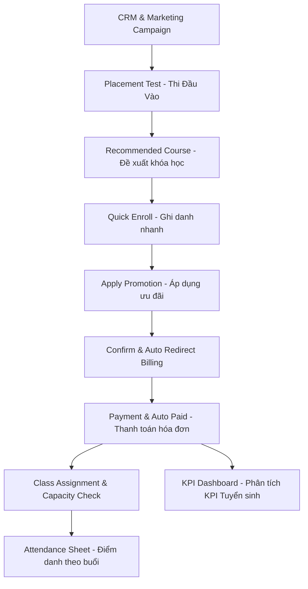

# Hệ thống Quản lý Đào tạo VUS (VUS ERP Custom Addons)

Bộ phân hệ mở rộng (Custom Addons) được phát triển trên nền tảng **Odoo 17.0** nhằm tối ưu hóa và số hóa toàn diện quy trình vận hành đào tạo, tuyển sinh, marketing, kế toán học phí và chăm sóc học viên cho hệ thống Anh Văn Hội Việt Mỹ (VUS).

---

## 📂 1. Cấu trúc và Chức năng các phân hệ

Dự án được module hóa thành các phân hệ độc lập, liên kết chặt chẽ qua các mối quan hệ nghiệp vụ:

1. **`vus_student`**: Quản lý thông tin học viên & giảng viên.
   - Kế thừa danh mục đối tác chuẩn `res.partner`.
   - Quản lý chi tiết vòng đời học viên thông qua các trạng thái: `Potential` (Tiềm năng), `Waiting` (Chờ xếp lớp), `Studying` (Đang học), `Reserved` (Bảo lưu), `Completed` (Hoàn thành).
   - Tối ưu hóa giao diện: Tạo menu **Nhân sự** riêng biệt gom nhóm Học viên và Giảng viên để dễ dàng truy xuất.
   - **Tính năng mới**: Hỗ trợ thiết lập **Số lớp dạy tối đa/kỳ** (`max_classes`) cho từng Giảng viên.
2. **`vus_course`**: Quản lý danh mục khóa học (`vus.course`).
   - Lưu trữ thông tin học phí gốc, cấp độ (Starter, Beginner, Intermediate, Advanced,...), số buổi học, thời lượng học.
   - **Nút thông minh (Smart Button)**: Xem nhanh số lượng lớp học đang mở thuộc khóa học và điều hướng nhanh sang danh sách lớp đó.
   - **Tính năng mới**: Hỗ trợ cấu hình **Số lớp tối đa/kỳ** (`max_classes`) cho từng khóa học.
3. **`vus_class`**: Quản lý thông tin lớp học (`vus.class`).
   - Ghi nhận ngày khai giảng, phòng học (`classroom`), lịch học, giảng viên phụ trách, sĩ số tối đa.
   - **Nút thông minh (Smart Button)**: Xem sĩ số học viên thực tế và điều hướng nhanh sang danh sách học viên đang theo học.
4. **`vus_enrollment`**: Ghi danh khóa học và liên kết kế toán tự động (`vus.enrollment`).
   - Tự động lấy thông tin học phí từ khóa học được cấu hình và kiểm tra ràng buộc không cho phép xác nhận ghi danh khi chưa chọn lớp học.
   - **Định hướng Kế toán**: Khi bấm xác nhận một phiếu ghi danh đơn lẻ, hệ thống tự động tạo hóa đơn khách hàng (`out_invoice`), đồng thời tự động điều hướng (Redirect) ngay sang giao diện Form hóa đơn đó để giáo vụ tiến hành thu phí nhanh chóng.
   - Trạng thái phiếu tự động chuyển thành **Đã thanh toán** khi hóa đơn được thanh toán đầy đủ.
5. **`vus_attendance`**: Quản lý điểm danh học viên hàng loạt theo buổi học (`vus.attendance`).
   - Cung cấp giao diện điểm danh theo buổi (`vus.attendance.sheet`), cho phép tải nhanh danh sách học viên từ lớp học và điểm danh hàng loạt bằng 1-Click.
   - Lưu trữ lịch sử chuyên cần chi tiết của từng học viên trực tiếp trên phiếu ghi danh.
   - **Bảo mật phân quyền**: Tối ưu hóa trường Giảng viên (`teacher_id`) trên bảng điểm danh thành dạng Many2one cho phép ghi nhận và thay đổi đối với cả giáo viên dạy thay hoặc dạy bù đứng lớp.
6. **`vus_marketing`**: Quản lý chiến dịch Marketing và theo dõi Leads (`vus.marketing.campaign`).
   - Theo dõi ngân sách chiến dịch, chi phí thực tế, chỉ tiêu Lead.
   - Kế thừa `crm.lead` để liên kết chiến dịch và nguồn (Facebook, Website, Sự kiện,...).
   - Tự động thống kê số lead thực tế, số lượng chuyển đổi thành công, doanh thu đóng học phí liên kết và tính toán tỷ lệ chuyển đổi cũng như tỷ suất sinh lợi **ROI (%)** chuẩn xác.
7. **`vus_placement_test`**: Quản lý lịch kiểm tra đầu vào và chấm điểm (`vus.placement.test`).
   - Ghi nhận điểm số 4 kỹ năng (Nghe, Nói, Đọc, Viết) và đề xuất khóa học phù hợp dựa trên tổng điểm.
   - Hỗ trợ nút hành động nhanh **Ghi danh (Enroll)** để tự động tạo phiếu ghi danh dựa trên đề xuất thi đầu vào.
8. **`vus_promotion`**: Quản lý Học bổng & Ưu đãi học phí (`vus.promotion`).
   - Định nghĩa mã giảm giá/học bổng (giảm theo % hoặc số tiền cố định VND).
   - Áp dụng kiểm tra điều kiện thời hạn sử dụng và số lượt dùng tối đa, tự động khấu trừ tiền học phí trên phiếu ghi danh.
9. **`vus_dashboard`**: Báo cáo phân tích KPI tuyển sinh.
   - Sử dụng mô hình SQL View `vus.recruitment.report` kết hợp dữ liệu từ CRM Lead, Thi đầu vào, Phiếu ghi danh và Hóa đơn kế toán.
   - Giao diện báo cáo Pivot và biểu đồ trực quan về doanh thu tuyển sinh, tỷ lệ chuyển đổi lead và hiệu quả marketing.
10. **`vus_resource_allocation`**: Quản lý phân bổ tài nguyên nâng cao (Lịch dạy, Báo vắng, Dạy thay).
    - Quản lý đăng ký ca học rảnh của giảng viên và tự động lọc động giảng viên khả dụng trên form lớp học.
    - Quản lý lịch học chi tiết từng buổi học (`vus.class.session`). Tích hợp Cron job tự động quét lịch học hôm nay và tạo thông báo Odoo Activity nhắc nhở đứng lớp hôm nay cho giảng viên.
    - Quản lý yêu cầu báo vắng và phân công giảng viên dạy thay/dạy bù.
11. **`vus_education_management`**: Module đóng gói (Bundle).
    - Phụ thuộc và tự động kích hoạt cài đặt đồng bộ toàn bộ 10 module con ở trên.

---

## 🛠️ 2. Yêu cầu hệ thống trước khi cài đặt

Để chạy thành công dự án này, máy tính của bạn cần đáp ứng các điều kiện sau:

* **Odoo**: Phiên bản **Odoo 17.0** (Community hoặc Enterprise).
* **Python**: Phiên bản **3.10** trở lên.
* **Hệ quản trị CSDL**: **PostgreSQL** 12 trở lên.
* **Các module tiêu chuẩn của Odoo** (Cần được cài đặt sẵn trên Database của bạn):
  * `contacts` (Danh bạ)
  * `crm` (Quản lý khách hàng tiềm năng)
  * `account` (Kế toán chuẩn Odoo)
  * `mail` (Hệ thống thảo luận)

---

## 🚀 3. Hướng dẫn Cài đặt & Khởi chạy chi tiết

Khi tải (clone) dự án này về máy, bạn thực hiện theo các bước sau để cấu hình và chạy dự án:

### Bước 1: Cấu hình `addons_path` cho máy chủ Odoo

Bạn cần khai báo thư mục `custom_addons` vừa tải về vào tệp cấu hình của Odoo (`odoo.conf`) để Odoo có thể tìm thấy các module tùy chỉnh này.

1. Tìm tệp `odoo.conf` trên máy chủ của bạn (Thường nằm trong thư mục gốc cài đặt Odoo hoặc thư mục cấu hình `/etc/odoo/`).
2. Mở file và tìm dòng `addons_path`. Thêm đường dẫn tuyệt đối đến thư mục `custom_addons` vào cuối dòng, phân tách bằng dấu phẩy `,`.

*Ví dụ trên Windows:*
```ini
addons_path = C:\Program Files\Odoo 17.0.20260615\server\odoo\addons,C:\du-an-cua-ban\custom_addons
```

*Ví dụ trên Linux / Docker:*
```ini
addons_path = /usr/lib/python3/dist-packages/odoo/addons,/mnt/extra-addons/custom_addons
```

---

### Bước 2: Khởi động lại dịch vụ Odoo

Mỗi khi thay đổi file cấu hình `odoo.conf` hoặc thêm module mới, bạn cần khởi động lại dịch vụ Odoo để cập nhật:

* **Trên Windows (Sử dụng PowerShell dưới quyền Administrator):**
  ```powershell
  Restart-Service -Name "odoo-server-17.0"
  ```
  *(Hoặc mở ứng dụng `Services` của Windows, tìm dịch vụ `odoo-server-17.0` và bấm **Restart**)*

* **Trên Linux:**
  ```bash
  sudo systemctl restart odoo
  ```

* **Trên Docker:**
  ```bash
  docker restart <ten_container_odoo>
  ```

---

### Bước 3: Cài đặt Module lên Database

#### Cách 1: Cài đặt trực tiếp từ giao diện Web (Khuyên dùng)
1. Đăng nhập vào giao diện Odoo bằng tài khoản Administrator.
2. Truy cập **Cài đặt** (Settings) -> Kích hoạt **Chế độ nhà phát triển** (Developer Mode).
3. Đi tới menu **Ứng dụng** (Apps).
4. Click vào nút **Cập nhật danh sách ứng dụng** (Update Apps List) trên thanh menu phụ và xác nhận cập nhật.
5. Tìm kiếm từ khóa `vus_education_management` trong ô tìm kiếm (Lưu ý: Tắt bộ lọc mặc định `Apps` nếu không tìm thấy).
6. Nhấn nút **Kích hoạt** (Activate/Install). Hệ thống sẽ tự động cài đặt module bundle này kèm theo toàn bộ các module con phụ thuộc.

#### Cách 2: Cài đặt nhanh qua Command Line Interface (CLI)
Bạn có thể cài đặt trực tiếp thông qua lệnh python khởi chạy odoo-bin:
```powershell
& "C:\Program Files\Odoo 17.0.20260615\python\python.exe" "C:\Program Files\Odoo 17.0.20260615\server\odoo-bin" -c "C:\Program Files\Odoo 17.0.20260615\server\odoo.conf" -d Vus_odoo -i vus_education_management --stop-after-init
```

---

### Bước 4: Khởi tạo dữ liệu mẫu Việt hóa quy mô lớn và Xuất file CSV

Để phục vụ kiểm thử nhanh toàn bộ luồng nghiệp vụ với các kịch bản thực tế (độ bao phủ ~80%) mà không cần tạo thủ công, dự án tích hợp sẵn script dọn dẹp và nạp dữ liệu tại đường dẫn `custom_addons/scratch/generate_realistic_data.py`.

#### ⚠️ QUAN TRỌNG: Cấu hình script trước khi chạy
Trước khi chạy script, hãy mở file `custom_addons/scratch/generate_realistic_data.py` bằng trình soạn thảo mã nguồn và điều chỉnh 2 biến cấu hình ở đầu file (Dòng 8 và Dòng 11) sao cho trùng khớp với môi trường local của bạn:

```python
# Mở file scratch/generate_realistic_data.py và chỉnh sửa:
config_file = r"C:\Đường_dẫn_thực_tế_đến_file\odoo.conf"
db_name = 'Tên_Database_Thực_tế_Của_Bạn'
```

#### Chạy script nạp và kết xuất dữ liệu:
Mở Terminal/PowerShell và thực thi lệnh sau:

* **Trên Windows:**
  ```powershell
  $env:PYTHONPATH="C:\Program Files\Odoo 17.0.20260615\server"; $env:PYTHONIOENCODING="utf-8"; & "C:\Program Files\Odoo 17.0.20260615\python\python.exe" "C:\Program Files\Odoo 17.0.20260615\server\custom_addons\scratch\generate_realistic_data.py"
  ```

Script sẽ thực hiện:
1. Xóa sạch dữ liệu mẫu cũ.
2. Tạo 3 Kỳ học (Hè, Thu, Đông), 8 Khóa học tiêu chuẩn, 8 Ca học, và 5 Giảng viên.
3. Tạo 35 học viên với tên tiếng Việt thật liên kết với 35 CRM Leads.
4. Phân bổ 4 Chiến dịch Marketing với ngân sách và chi phí thực tế giúp phân tách biểu đồ doanh thu và ROI cực đẹp.
5. Tạo 28 Phiếu ghi danh, tự động sinh Hóa đơn kế toán và ghi nhận thanh toán.
6. Kết xuất dữ liệu mẫu đã tạo ra **9 tệp CSV chuẩn** đặt tại thư mục `custom_addons/scratch/export_data/` để bạn có thể tải về hoặc import thủ công nếu cần.

---

## 📖 4. Hướng dẫn Luồng kiểm thử nghiệp vụ chính (End-to-End Flow)

Hãy thực hiện kiểm thử hệ thống theo trình tự nghiệp vụ chuẩn của một trung tâm Anh ngữ như sau:



### Bước 1: Quản lý Marketing & Chiến dịch
* Vào menu **Marketing** -> **Chiến dịch Marketing** -> Kiểm tra chiến dịch mẫu **Chiến dịch Tuyển sinh Hè 2026** (Trạng thái: *Đang chạy*).
* Truy cập **CRM**, kiểm tra các Leads mẫu đã được phân công nguồn tuyển sinh (Facebook, Website...) và tự động liên kết với chiến dịch này.

### Bước 2: Tổ chức Thi đầu vào & Chấm điểm
* Vào menu **Tuyển sinh & Đăng ký** -> **Kiểm tra đầu vào** -> Chọn lịch thi mẫu **Kiểm tra trình độ IELTS tháng 5**.
* Xem danh sách thí sinh làm bài và điểm số 4 kỹ năng (Nghe, Nói, Đọc, Viết). Click **Xác nhận điểm** để chuyển đổi trạng thái thí sinh sang *Chờ xếp lớp*.
* Nhấn nút **Ghi danh (icon người +)** ở cuối dòng điểm của thí sinh để chuyển hướng tự động tạo Phiếu ghi danh.

### Bước 3: Tạo Phiếu ghi danh & Áp dụng Ưu đãi
* Trên phiếu ghi danh nháp vừa tạo, chọn **Lớp học đăng ký** (ví dụ: *IELTS Foundation Class A*).
* Chọn **Chương trình ưu đãi/Học bổng** (ví dụ: mã *HE2026_10* - giảm 10% hoặc *SCHOLAR_1M* - giảm 1.000.000 VND).
* Hệ thống sẽ tự động tính toán số tiền được giảm giá và cập nhật tổng tiền học phí thực tế của học viên.

### Bước 4: Xác nhận Ghi danh & Tự động Redirect Kế toán
* Click **Xác nhận**. Hệ thống tự động chuyển phiếu ghi danh sang trạng thái *Chờ thanh toán*, tự sinh hóa đơn khách hàng (`out_invoice`) và **tự động chuyển hướng màn hình** thẳng đến giao diện hóa đơn đó để bạn thu tiền luôn.
* Click ghi nhận thanh toán hoàn tất cho hóa đơn này bên Kế toán. Quay lại phiếu ghi danh, bạn sẽ thấy trạng thái đã tự động đổi sang **Đã thanh toán** nhờ cơ chế đồng bộ tự động.

### Bước 5: Kiểm soát Sĩ số & Giới hạn Khóa học/Giảng viên
* **Sĩ số lớp:** Mở lớp học *Super Minds 1 Class A* (sĩ số tối đa là 15). Nếu lớp đã đủ học viên đã thanh toán, hệ thống sẽ chặn không cho xác nhận ghi danh mới vào lớp này.
* **Số lớp tối đa của Khóa học:** Khóa IELTS Foundation được đặt giới hạn tối đa 5 lớp/kỳ học. Khi đạt giới hạn, tên khóa học sẽ tự động biến mất khỏi ô chọn khóa học của lớp mới.
* **Số lớp dạy tối đa của Giảng viên:** Giáo viên John Smith được đặt giới hạn dạy tối đa 3 lớp/kỳ học. Khi đã phân công đủ 3 lớp, tên giáo viên này sẽ tự động ẩn khỏi danh sách chọn Giảng viên.

### Bước 6: Điểm danh Lớp học hàng loạt
* Đăng nhập tài khoản Giáo viên (`teacher@vus.edu.vn` / mật khẩu `admin`) hoặc Giáo vụ.
* Vào menu **Điểm danh** -> **Điểm danh theo buổi** -> Nhấn **Tạo mới**.
* Chọn **Lớp học** (ví dụ: *IELTS Foundation Class A*).
* Nhấn nút **Tải danh sách học viên** để tự động nạp toàn bộ học viên đang học trong lớp với trạng thái mặc định là "Có mặt".
* Giáo viên hoặc giáo viên dạy thay được gán ca học này đều có quyền điểm danh và lưu lại mà không bị lỗi bảo mật.

### Bước 7: Xem Báo cáo KPI & Dashboard tuyển sinh
* Truy cập menu **Báo cáo KPI**.
* Theo dõi các chỉ số trực quan dưới dạng biểu đồ hoặc bảng phân tích Pivot: tổng doanh thu học phí thu được, tỷ lệ chuyển đổi từ Lead sang Học viên thực tế và hiệu quả doanh thu mang lại của từng Chiến dịch Marketing.

---

## 🛡️ 5. Phân quyền và Bảo mật (Role-Based Access Control)

Hệ thống được tích hợp sẵn cơ chế phân quyền (RBAC) chặt chẽ với 3 vai trò (Role) cốt lõi:

### Các vai trò (Roles) trong hệ thống
1. **Quản lý (Manager)**: 
   - Có toàn quyền (Full Access) xem, tạo, sửa, xóa (CRUD) trên toàn bộ các phân hệ của hệ thống.
   - Được gán bổ sung nhóm **Quản lý Sales (Sales Administrator)** và **Quản lý Billing (Billing Administrator)** của Odoo tiêu chuẩn để xem báo cáo doanh thu & hóa đơn.
2. **Nhân viên (Staff)**:
   - Dành cho bộ phận Tư vấn viên, Giáo vụ, Kế toán.
   - Được quyền truy cập các luồng nghiệp vụ hoạt động hàng ngày (Ghi danh, Chăm sóc Lead, Tổ chức thi đầu vào, Điểm danh).
   - Được gán bổ sung nhóm **Nhân viên Sales (Sales User: All Documents)** và **Nhân viên Billing (Billing)** để xử lý CRM Leads và Hóa đơn.
   - Bị hạn chế quyền xóa (Delete) ở một số dữ liệu quan trọng như Hóa đơn, Thông tin Khóa học.
3. **Giảng viên (Teacher)**:
   - Bị hạn chế quyền truy cập vào các phân hệ kinh doanh và dữ liệu nhạy cảm (như Marketing, Phiếu ghi danh, Học phí & Ưu đãi, KPI Dashboard).
   - **Bảo mật cấp bản ghi (Record Rules)**: Giảng viên chỉ được phép xem thông tin **Lớp học** và thực hiện **Điểm danh** cho những lớp mà *chính họ được phân công phụ trách* (hoặc được phân công dạy thay/dạy bù). Họ có quyền đọc học viên lớp họ dạy nhưng có 0 quyền tạo/sửa/xóa phiếu ghi danh.

---

## 🛠️ 6. Hướng dẫn xử lý sự cố thường gặp (Troubleshooting)

| Vấn đề | Nguyên nhân phổ biến | Cách khắc phục |
| :--- | :--- | :--- |
| **Không tìm thấy module custom trong danh sách ứng dụng** | Sai đường dẫn `addons_path` trong file `odoo.conf` hoặc chưa kích hoạt chế độ Developer Mode để "Cập nhật ứng dụng". | Kiểm tra kỹ đường dẫn trong `odoo.conf`. Đảm bảo khởi động lại dịch vụ Odoo trước khi nhấn nút "Cập nhật danh sách ứng dụng". |
| **Lỗi thiếu module dependency (`account`, `crm`...)** | Database hiện tại của bạn là database trống chưa được cài các ứng dụng cốt lõi của Odoo. | Hãy vào menu **Ứng dụng** (Apps) cài đặt trước các module **CRM**, **Invoicing / Accounting**, **Contacts** trước khi cài đặt `vus_education_management`. |
| **Lỗi chạy script `generate_realistic_data.py`** | Sai đường dẫn tệp `config_file` hoặc sai tên `db_name` cấu hình ở đầu script. | Mở file script và sửa chính xác đường dẫn đến file `odoo.conf` trên máy của bạn và tên cơ sở dữ liệu (Database) đang dùng. |
| **Lỗi Encoding khi chạy script trên PowerShell** | PowerShell mặc định sử dụng encoding ASCII/ANSI nên bị lỗi ký tự Tiếng Việt. | Hãy chạy lệnh thiết lập `$env:PYTHONIOENCODING="utf-8"` trước khi gọi lệnh chạy script Python (như hướng dẫn ở Bước 4). |
| **Không tự động sinh được hóa đơn khi bấm xác nhận Ghi danh** | Do hệ thống kế toán của Odoo trên Database chưa được thiết lập Sổ nhật ký bán hàng (Sale Journal) mặc định. | Truy cập **Kế toán** -> **Cấu hình** -> Thiết lập ít nhất một Sổ nhật ký loại "Bán hàng" (Sale Journal). |

---
*Chúc bạn cài đặt và trải nghiệm hệ thống thành công! nếu gặp bất kỳ khó khăn nào trong quá trình vận hành, vui lòng liên hệ nhóm phát triển dự án.*
